# FreshLaundry – Aplikasi Antar Jemput Laundry

**FreshLaundry** adalah aplikasi Android untuk layanan **antar-jemput laundry** yang memudahkan pelanggan dalam melakukan pemesanan, penjadwalan, dan pelacakan status secara real-time.  
Aplikasi ini juga dirancang untuk membantu operasional laundry agar lebih cepat, rapi, dan efisien.

---

## Fitur Utama

### 👤 Pelanggan
- Registrasi & login
- Pemesanan layanan laundry
- Pilih jadwal antar & jemput
- Menentukan lokasi menggunakan GPS ( Pembatasan Radius Max 30 KM dari lokasi Store Laundry )
- Melihat status pesanan secara real-time
- Chat dengan admin/kurir
- Notifikasi

### 🚚 Kurir
- Melihat daftar pesanan
- Menampilkan rute tercepat ke lokasi pelanggan
- Update status pengambilan & pengantaran
- Navigasi berbasis lokasi
- Chat dengan Pelanggan

### 🧑‍💼 Admin
- Kelola data pesanan
- Kelola data pelanggan & kurir
- Monitoring proses laundry
- Melihat aktivitas sistem secara real-time
- Chat dengan Pelanggan

---

## 🖼️ Tampilan Aplikasi (Halaman Pelanggan)

### Login & Register
<table align="center">
  <tr>
    <td align="center">
      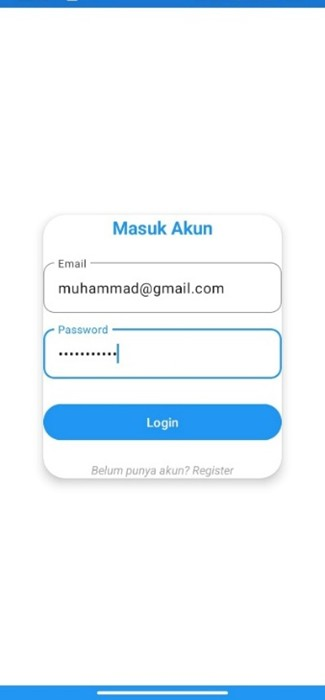 
      <b>Login</b>
    </td>
    <td align="center">
      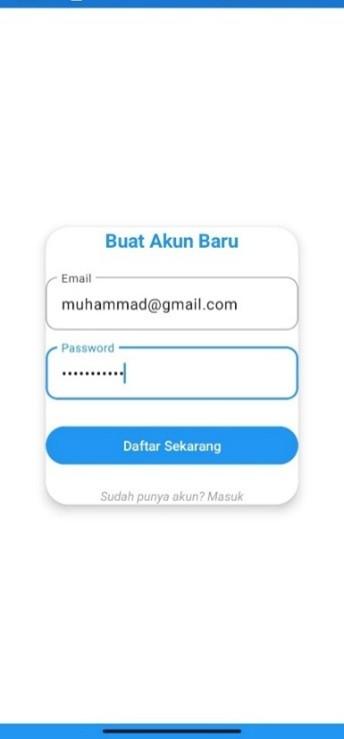 
      <b>Register</b>
    </td>
  </tr>
</table>

---

### Form & Proses Pemesanan
<table align="center">
  <tr>
    <td align="center">
      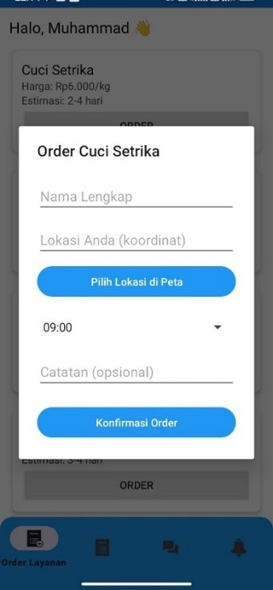 
      <b>Form Pemesanan</b>
    </td>
    <td align="center">
      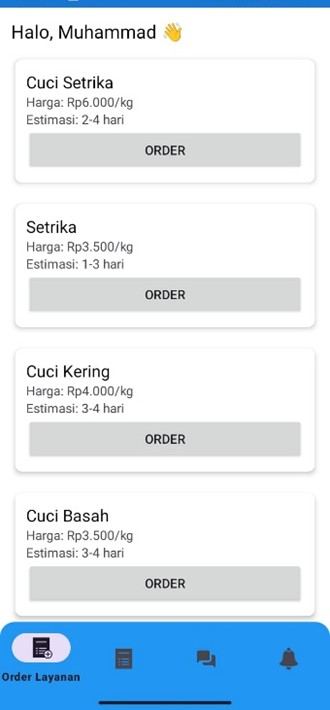 
      <b>Data Pemesanan</b>
    </td>
  </tr>
</table>

---

### Penentuan Lokasi & Jadwal
<table align="center">
  <tr>
    <td align="center">
      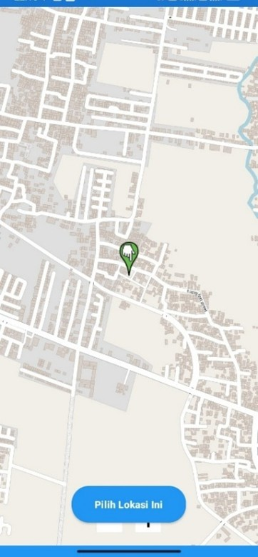 
      <b>Titik Koordinat</b>
    </td>
    <td align="center">
       
      <b>Set Waktu Penjemputan</b>
    </td>
  </tr>
</table>

---

### Pesanan Saya

  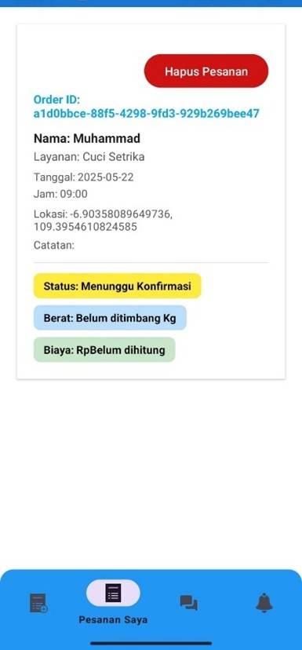 
  <b>Pesanan Saya</b>

---

### Chat & Notifikasi
<table align="center">
  <tr>
    <td align="center">
      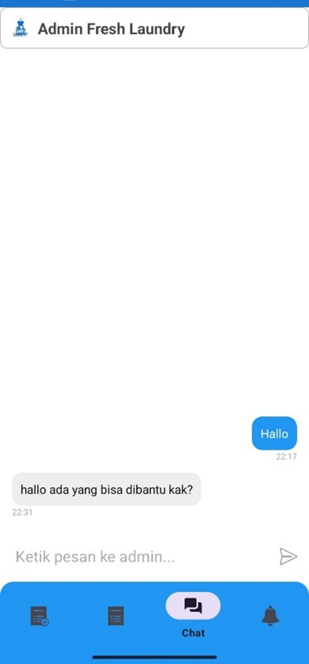 
      <b>Chat</b>
    </td>
    <td align="center">
      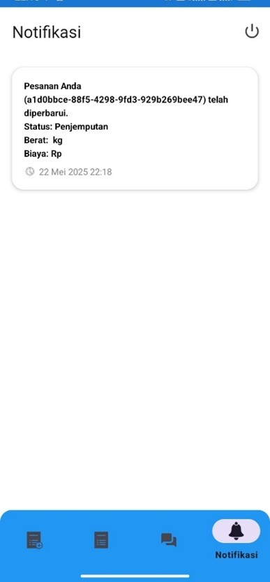 
      <b>Notifikasi</b>
    </td>
  </tr>
</table>

---

### Status Bar Notifikasi

  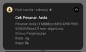 
  <b>Status Bar Notification</b>

---

## 🖼️ Tampilan Aplikasi (Admin & Kurir)

---

## Tampilan Admin

### Login Admin

  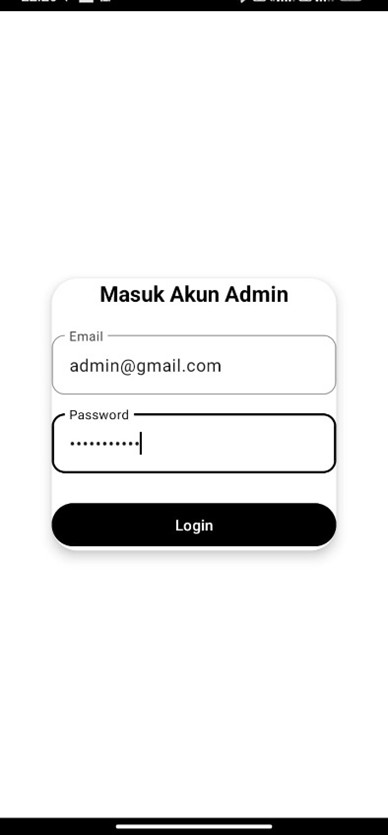 
  <b>Login Admin</b>

---

### Kelola & Konfirmasi Pesanan
<table align="center">
  <tr>
    <td align="center">
      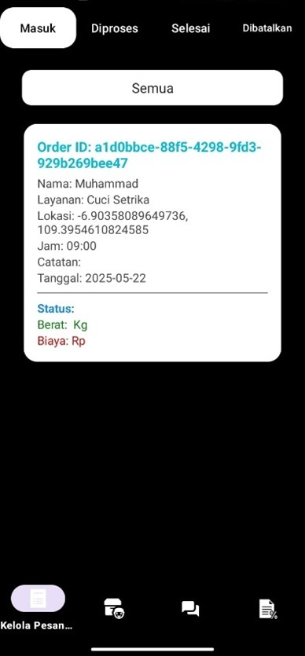 
      <b>Kelola Pesanan</b>
    </td>
    <td align="center">
      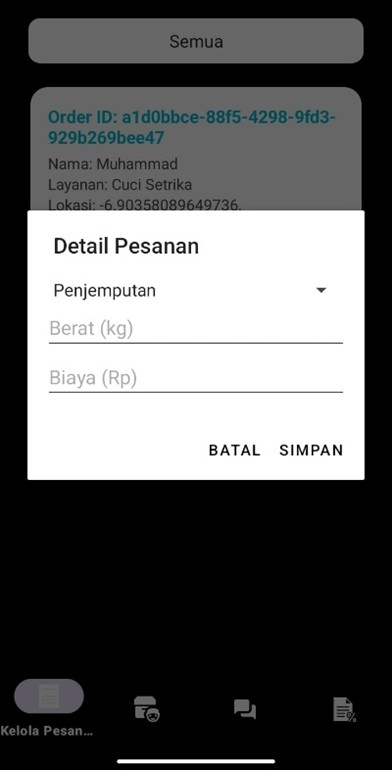 
      <b>Konfirmasi Pesanan</b>
    </td>
  </tr>
</table>

---

### Chat Admin dengan Pelanggan
<table align="center">
  <tr>
    <td align="center">
       
      <b>List Chat Pelanggan</b>
    </td>
    <td align="center">
       
      <b>Chat dengan Pelanggan</b>
    </td>
  </tr>
</table>

---

### Laporan

  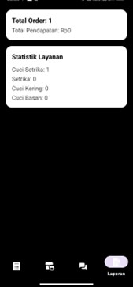 
  <b>Laporan</b>

---

## Tampilan Kurir

### Daftar Penjemputan

  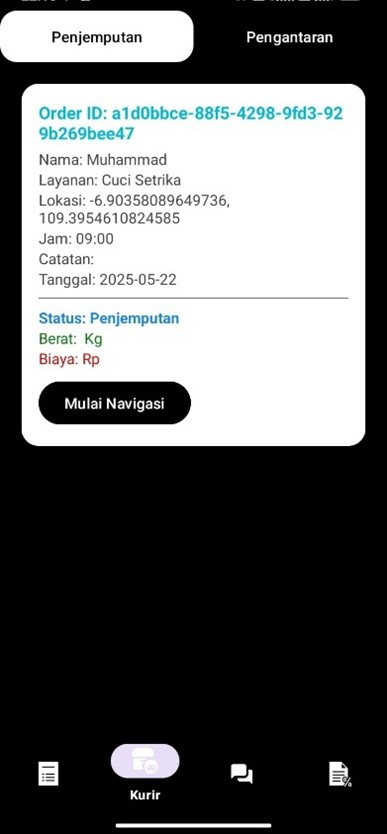 
  <b>List Penjemputan Kurir</b>

---

### Navigasi Kurir

   
  <b>Navigasi Kurir</b>

## Sistem Navigasi

Aplikasi ini menggunakan:
- **GPS** untuk menentukan posisi pelanggan dan kurir
- **Algoritma A-Star (A\*)** untuk menghitung rute tercepat
- Perhitungan rute dilakukan berdasarkan koordinat lokasi

---

## Teknologi yang Digunakan

- **Android (Native)**  
- **Firebase Realtime Database**  
- **Firebase Authentication**
- **FCM**
- **GPS / Location Service**
- **Algoritma A-Star (A\*)**
- **OpenStreetMap**

---

## Download Aplikasi

FreshLaundry terdiri dari **2 aplikasi Android terpisah**

---

### FreshLaundry – Aplikasi Pelanggan

   <a href="https://drive.google.com/file/d/1EnAGuutx6ny9vrv4daoWonfO8RwJvMG8/view?usp=sharing" target="_blank">
    <b>Download APK FreshLaundry Pelanggan</b>
  </a>

---

### FreshLaundry – Aplikasi Admin & Kurir

   <a href="https://drive.google.com/file/d/1UTPqvDqdEq12h5cAxYyKnEFl_5bXkfAz/view?usp=sharing" target="_blank">
    <b>Download APK FreshLaundry Admin & Kurir</b>
  </a>

---

> ⚠️ **Catatan Instalasi**
> - Aktifkan **Install from Unknown Sources** di pengaturan Android

## License

This project is licensed under **All Rights Reserved**.

The APK file is provided for **demo and personal use only**.
All source code, assets, and documentation in this repository are the exclusive property of the author.  
No part of this project may be copied, modified, or used for commercial purposes without explicit permission.

© 2026 Zainul Muhajir
